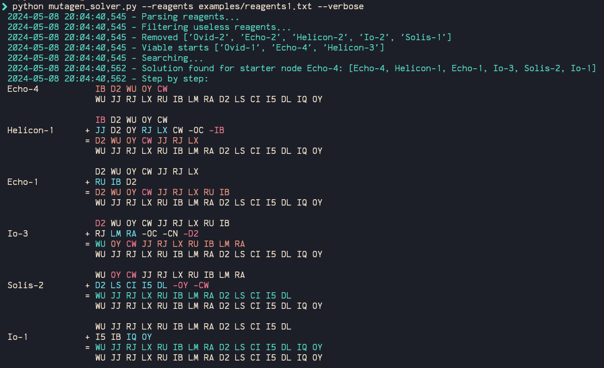

# MUTAGEN PUZZLE SOLVER

This solver is a CLI tool designed for quickly and efficiently solving the [mutagen puzzle in Underrail](https://www.stygiansoftware.com/wiki/index.php?title=Mutagen_Puzzle). It started out as a simple breadth-first search that worked relatively well but would take more than 25 seconds on some examples so I decided to make it a bit smarter.

## Requirements

- Python 3
  - colorlog
  - colorama

## Installation

1.  Clone or download the repository from GitHub to your local machine. If you have Git installed, you can clone the repository using the following command:

        git clone https://github.com/vm910/mutagen_solver

    Alternatively, you can download the script and its utilities directly from the GitHub repository page.

2.  Install dependencies:

        pip install colorlog colorama

## Arguments

The solver accepts several command-line arguments that allow you to customize its behavior. Below is a list of these arguments and their descriptions:

- `--reagents` (Required): Specifies the path to the file containing reagent data.

        --reagents path/to/reagents.txt

  example of a reagents file:

  ```
      Exitus-1 WU JJ RJ LX RU IB LM RA D2 LS CI I5 DL IQ OY
      Ovid-1 LX CW WU -RJ
      Ovid-2 JJ P9 IQ LX RU -D2
      Ovid-3 RJ CN IQ OC -RA -CI -LX
      Echo-1 RU IB D2
      Echo-2 P9 CI OY LS OC DL RJ -CW -IQ -WU
      Echo-3 CN RU IB
      Echo-4 IB D2 WU OY CW -RJ
      Helicon-1 JJ D2 OY RJ LX CW -OC -IB
      Helicon-2 ED JJ OY I5 P9 -LM -WU -CI
      Helicon-3 CW D2 WU -IQ
      Io-1 I5 IB IQ OY
      Io-2 P9 CN I5 OC -LS
      Io-3 RJ LM RA -OC -CN -D2
      Solis-1 WU ED RA IB -JJ -I5
      Solis-2 D2 LS CI I5 DL -OY -CW
  ```

- `--depth` (Optional): Sets the depth limit for the search. The default value is 15. Increasing the depth may increase the time taken to find a solution.

        --depth 20

- `--first` (Optional): If set, the solver will stop and return the first solution it finds. By default, the solver searches for all possible solutions.

- `--debug` (Optional): Enables debug mode, which provides additional information during the program execution. This is might be useful for troubleshooting or understanding the solver's process.

- `--verbose` (Optional): If set, the program outputs a detailed step-by-step description of the solution process. This is useful for users who want to understand how a particular solution is reached. Example of a step by step output:

  

- `--start` (Optional): Allows you to specify a starting reagent for the search. If not set, the solver will choose the starting point based on its heuristic analysis. Use if you want to test specific starting points that aren't automatically chosen.

        --start Echo-1

Example of running the solver with a combination of these arguments:

    python mutagen_solver.py --reagents examples/reagents.txt --depth 12 --first --verbose

## Search method

The solver employs a priority search or "Best first search" as the scholars say, which proved much better than the other BFS (breadth first search). This method uses a [priority queue](https://docs.python.org/3/library/heapq.html) to manage and explore different combinations of reagents, focusing on the most promising paths first. Each potential combination of reagents, or state, is assigned a priority based on a heuristic function. The states with higher priority (i.e., closer to the goal) are explored first. The method also employs a safeguard, where if a solution is not found after 2500 iterations, it will terminate. This was added to prevent the search from going on indefinitely.

### Heuristic Function

[The heuristic function](https://github.com/vm910/underrail-mutagen-solver/blob/b6d5c0dd4d8244c6aa5bc10b013caaaccb35a5d6/utils.py#L145C1-L159C1) evaluates and scores each state based on its proximity to `Exitus`. It is based on the heuristic made by [Spilskinanke](https://github.com/Spilskinanke/Mutagen-Solver/blob/main/src/mutagen.adb#L144C1-L168C22). This heuristic was modified to be more lenient at the start and then as the path builds up, it would heavily discourage mismatches.
